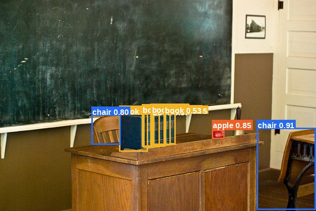
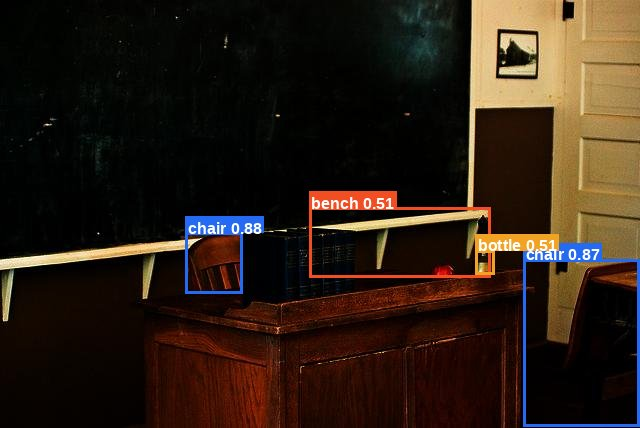
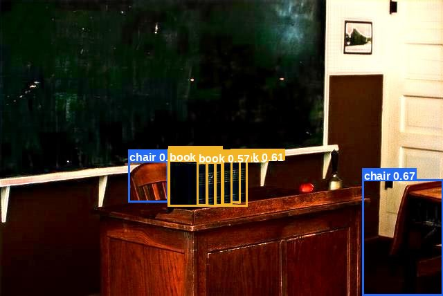
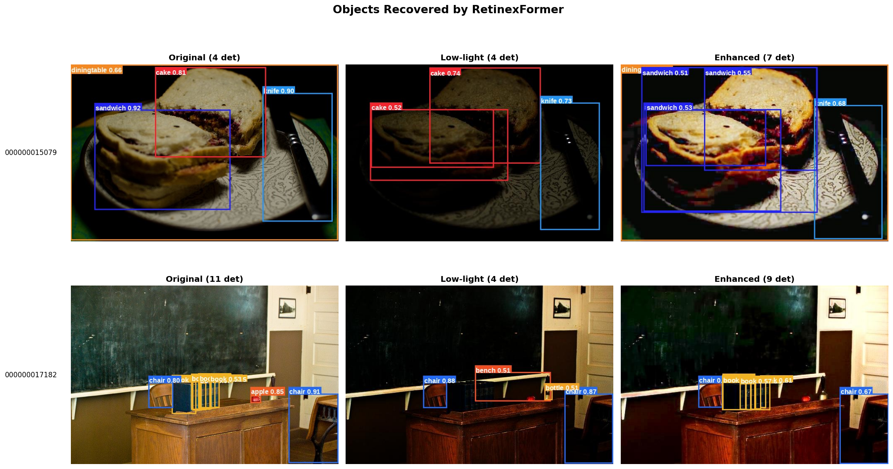
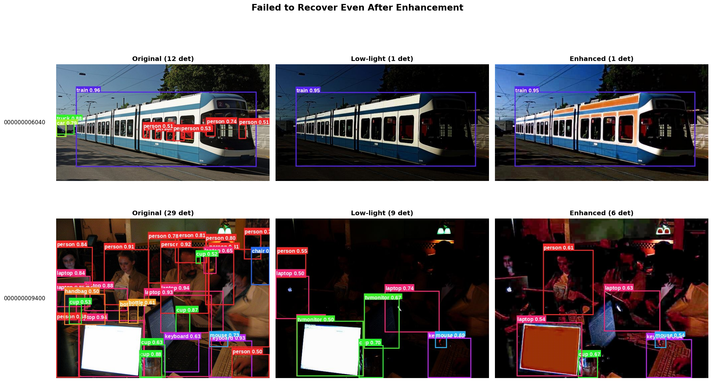
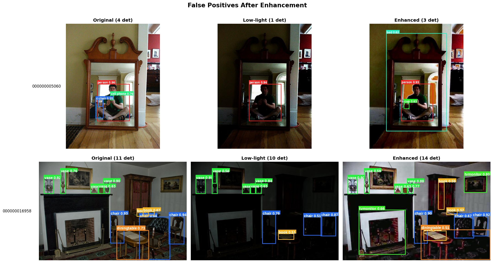

# RT-DETRv2 Detection Case Study

## 1. 사용 모델

| 항목 | 내용 |
|------|------|
| **모델명** | RT-DETRv2 (Real-Time Detection Transformer v2) |
| **체크포인트** | `PekingU/rtdetr_v2_r50vd` |
| **백본** | ResNet-50 VD |
| **출처** | HuggingFace `transformers` (v4.51.3) |
| **학습 데이터** | COCO 2017 (80 classes, pretrained) |
| **하드웨어** | Google Colab T4 GPU (16GB VRAM) |
| **추론 환경** | PyTorch, CUDA |

RT-DETRv2는 DETR 계열의 실시간 객체 탐지 모델로,
본 실험에서는 사전학습 가중치를 그대로 사용하여 **입력 이미지 품질 변화가 동일 모델의 탐지 결과에 어떤 영향을 미치는지** 비교한다.

---

## 2. 탐지 대상 데이터

| 항목 | 내용 |
|------|------|
| **베이스 데이터셋** | COCO val2017 |
| **평가 부분집합** | `sample_200` (200장) |
| **GT 라벨** | `annotations_sample_200.json` |

### 세 가지 입력 조건

| 조건 | 설명 | 폴더 |
|------|------|------|
| **Original** | COCO val2017 원본 이미지 | `data/sample_200/original/` |
| **Low-light** | 원본에 감마 보정 `γ=3.0` 적용 | `data/sample_200/low_light_gamma3.0/` |
| **Enhanced** | 야간 합성본을 RetinexFormer로 복원 | `data/enhanced_sample_200/` |

세 조건은 **동일한 200장**(파일명 기준)에 대해 생성되어 픽셀 단위 비교가 가능하다.

---

## 3. Confidence Threshold 설정

| 항목 | 값 |
|------|-----|
| **기본 threshold** | 0.5 |
| **선정 근거** | 객체 탐지 분야 표준 기준 |

### 임계값 선택 이유
- **0.5 (채택)**: 객체 탐지 분야의 일반적 기본값. 모델이 "절반 이상 확신한" 탐지만 채택.
- 0.3: 더 많은 객체 탐지 가능하지만 오탐 위험 증가.
- 0.7: 확실한 객체만 보지만 약한 탐지 손실.

본 실험은 "야간 vs 복원 이미지 비교"가 목적이므로, 세 조건 모두 동일한 0.5 threshold로 평가하여 공정성을 확보했다.

---

## 4. 원본 이미지 탐지 예시



### 전체 통계 (sample_200, threshold 0.5)

| 항목 | 값 |
|------|----|
| 총 탐지 객체 수 | **1,494개** |
| 이미지당 평균 | **7.47개** |

원본 이미지에서 RT-DETRv2는 안정적으로 객체를 탐지한다. 
위 예시(`000000017182.jpg`)에서는 의자, 책, 사과 등 11개의 객체가 정확한 클래스로 탐지되었다.

---

## 5. 야간 이미지 탐지 예시



### 전체 통계

| 항목 | 값 | 원본 대비 |
|------|----|-----------|
| 총 탐지 객체 수 | **1,182개** | -312개 |
| 이미지당 평균 | **5.91개** | **-20.9%** |

`γ=3.0` 감마 보정으로 픽셀값이 감쇠하여 이미지가 어두워졌다. 그 결과 두 가지 현상이 동시에 발생한다:

1. **객체 손실**: 원본의 객체가 어둠에 묻혀 탐지되지 않음
2. **분류 오류**: 흐릿한 객체를 다른 클래스로 잘못 분류 (예: 샌드위치→케이크, 종→병)

전체 200장에서:
- **약 21%의 탐지 수 감소**
- **14%의 이미지에서 50% 이상의 객체 손실** (28/200)
- 위 예시에서 사과/책이 사라지고, 받침대를 벤치로, 종을 병으로 오탐.

---

## 6. 복원 이미지 탐지 예시



### 전체 통계

| 항목 | 값 | 야간 대비 | 원본 대비 |
|------|----|-----------|-----------|
| 총 탐지 객체 수 | **1,200개** | +18개 | -294개 |
| 이미지당 평균 | **6.00개** | +0.09 | -19.7% |

RetinexFormer로 야간 합성본을 복원했을 때 흥미로운 양면성이 관측되었다:

- **평균 탐지 수 변화는 미미** (5.91 → 6.00)
- **그러나 22.5%(45/200)의 이미지에서 복원 효과 관측**
- 복원이 단순 회복뿐 아니라 **야간 오탐을 정화**하는 효과도 있음 (예: 17182에서 종/받침대 오탐 제거)
- 일부 사례에서는 **새로운 오탐을 유발**

위 예시에서는 야간에서 사라졌던 책이 다시 탐지되고, 야간의 모든 오탐이 제거되었다.

---

## 7. 탐지 성공 사례 (복원 후 다시 탐지된 케이스)



### 7.1 `000000015079.jpg`: 원본 4 → 야간 4 → **복원 7**

| 단계 | 탐지 결과 |
|------|-----------|
| 원본 | 3개 객체 정확 탐지 및 1개의 샌드위치 케이크로 오탐 |
| 야간 | **모든 샌드위치를 케이크로 오분류** |
| 복원 | **샌드위치를 정확히 분류** |

이 사례는 단순한 객체 회복이 아닌 **"분류 정확도 회복"** 을 보여준다. 
야간에서 객체 자체는 인식되었으나 어두운 조명 때문에 시각적 특징이 흐려져 다른 클래스로 잘못 분류되었다. 
RetinexFormer 복원으로 색상과 텍스처가 회복되자 RT-DETRv2가 다시 정확한 클래스(샌드위치)로 인식하게 되었다.

### 7.2 `000000017182.jpg`: 원본 11 → 야간 4 → **복원 9**

| 단계 | 탐지 결과 |
|------|-----------|
| 원본 | 사과, 책, 의자 등 11개 정확 탐지 |
| 야간 | 사과·책 사라짐, **받침대→벤치, 종→병 오탐 발생** |
| 복원 | **책 재탐지, 모든 야간 오탐 제거** (단, 사과는 여전히 미탐지) |

이 사례는 복원의 **두 가지 긍정적 효과**를 동시에 보여준다:

1. **객체 회복**: 야간에서 사라진 책이 복원으로 다시 탐지됨
2. **오탐 정화**: 야간에서 발생한 오탐(받침대→벤치, 종→병)이 복원 후 모두 사라짐

다만 사과는 복원 후에도 탐지되지 않아, 복원이 모든 객체를 완벽히 회복시키지는 못함을 보여준다.

### 종합 해석

복원이 효과적으로 작동한 케이스의 공통점:
- 객체 윤곽이 야간에서도 부분적으로 남아있음
- 텍스처/색상 정보가 비교적 보존됨
- 배경과 객체의 명도 차이가 어느 정도 존재

흥미로운 발견은 **RetinexFormer가 단순히 사라진 객체를 회복시키는 것뿐만 아니라, 어둠으로 인해 발생한 오탐을 동시에 교정**한다는 점이다.

전체 200장 중 **45건(22.5%)** 에서 복원 후 탐지 수가 야간보다 증가했다.

---

## 8. 탐지 실패 사례

복원이 효과적이지 않거나 오히려 부정적으로 작용한 사례를 두 유형으로 나누어 분석한다.

### 8.1 복원해도 실패한 케이스



#### `000000006040.jpg`: 원본 12 → 야간 1 → 복원 1

| 단계 | 탐지 결과 |
|------|-----------|
| 원본 | 차, 트럭, 사람 여러 명 등 12개 탐지 |
| 야간 | **11개 객체 모두 사라짐** (1개만 남음) |
| 복원 | **여전히 탐지 못함** (회복률 0%) |

원본의 **92%(11개)** 가 야간에서 손실되었고, RetinexFormer 복원으로도 단 하나도 회복되지 않았다.

복원이 밝기만 회복시킬 뿐 객체의 윤곽 정보까지 살리지는 못한 사례.

#### `000000009400.jpg`: 원본 29 → 야간 9 → **복원 6** (오히려 감소)

| 단계 | 탐지 결과 |
|------|-----------|
| 원본 | 사람, 병, 의자, 노트북 등 29개 탐지 |
| 야간 | **사람·병·의자 일부 사라짐, 노트북을 TV로 오탐** |
| 복원 | **야간 오탐(노트북→TV)은 제거, 그러나 사라진 객체 회복 실패, 추가로 탐지 수 더 감소** |

이 사례는 RetinexFormer의 **양면적 효과**를 동시에 보여준다:

- **긍정**: 야간에서 발생한 노트북→TV 오분류가 복원 후 제거됨
- **부정**: 야간에 사라진 객체들을 회복하지 못했을 뿐 아니라, 복원 과정에서 기존 탐지마저 일부 사라짐 (9→6)

복잡한 장면(원본 29개)에서 RetinexFormer의 복원이 일관된 품질을 보장하지 못하는 한계가 드러난 사례.

### 8.2 복원으로 오탐 증가한 케이스



#### `000000005060.jpg`: 원본 4 → 야간 1 → 복원 3 (+2)

| 단계 | 탐지 결과 |
|------|-----------|
| 원본 | 4개 객체 정확 탐지 |
| 야간 | 의자, 핸드폰 사라짐 (1개만 남음) |
| 복원 | **사라진 객체 회복 못함, 거울을 침대로 오탐, 사람의 팔을 컵으로 오탐** |

숫자상으로는 1→3으로 회복으로 보이나, **시각 검토 결과 추가된 2개 박스는 모두 오탐**이었다:
- 거울 → 침대로 오인
- 사람의 팔 → 컵으로 오인

이는 복원 과정에서 발생한 색상 변화나 모양 왜곡이 RT-DETRv2를 혼란시킨 사례.

#### `000000016958.jpg`: 원본 11 → 야간 10 → **복원 14** (+4)

| 단계 | 탐지 결과 |
|------|-----------|
| 원본 | 책상, 책 등 11개 탐지 |
| 야간 | 책상·책 일부 사라짐 |
| 복원 | **책상/책 회복 성공, 그러나 난로·액자를 TV로 오탐** |

이 사례는 **회복과 오탐이 동시에 발생**한 사례다. 
RetinexFormer 복원으로 책상과 책을 다시 탐지하는 데 성공했지만, 동시에 난로와 액자를 TV로 오인하는 새로운 오탐이 발생했다.

복원이 일부 객체 정보를 회복시키는 동시에, 다른 영역에서는 시각적 패턴을 왜곡하여 모델을 혼란시킨 양면적 결과.

### 종합 해석

탐지 실패 사례는 RetinexFormer 복원의 두 가지 한계를 보여준다:

| 유형 | 원인 추정 | 사례 |
|------|----------|------|
| **회복 실패** | 야간 합성 단계의 정보 손실이 너무 커서 복원 알고리즘의 입력 자체가 부족 | 6040 (92% 손실, 0% 회복) |
| **복원 부작용** | 복원 과정에서 발생한 색상/형태 왜곡이 모델을 혼란시킴 | 5060 (거울→침대 오탐) |
| **양면 효과** | 일부 객체는 회복되나 다른 영역에 새 오탐 발생 | 16958 (책상/책 회복 + 난로/액자→TV 오탐) |

전체 200장 중 **5건(2.5%)** 에서 복원이 오히려 탐지를 감소시키거나 회복에 실패했고, **4건(2%)** 에서 복원으로 새로운 오탐이 발생했다.

---

## 9. 발표용 해석


### 정량 결과 요약

#### 탐지 개수 비교

| 조건 | 총 탐지 | 장당 평균 | 원본 대비 |
|------|---------|-----------|-----------|
| Original | 1,494 | 7.47 | — |
| Low-light (γ=3.0) | 1,182 | 5.91 | **-20.9%** |
| Enhanced (RetinexFormer) | 1,200 | 6.00 | -19.7% |

#### mAP 비교 (COCO 표준 평가, sample_200 기준)

| 조건 | mAP@0.5 | mAP@0.5:0.95 |
|------|---------|--------------|
| **A: Original** | **68.43%** | **53.37%** |
| **B: Low-light (γ=3.0)** | 53.79% | 40.81% |
| **C: Enhanced (RetinexFormer)** | 49.84% | 36.90% |

**핵심 관측:**
- 야간 합성으로 mAP@0.5 기준 **-14.64%p** 하락 (68.43 → 53.79)
- RetinexFormer 복원 후 mAP는 **추가 하락** (53.79 → 49.84, -3.95%p)
- 탐지 개수는 야간 1,182 → 복원 1,200으로 증가했으나, mAP는 오히려 떨어짐
- 이는 **복원으로 늘어난 박스 중 일부가 GT와 위치/클래스 불일치**(즉 오탐)임을 정량적으로 확인시켜 줌

### 사례 분포

| 카테고리 | 건수 | 비율 |
|---------|------|------|
| 야간에서 50%+ 객체 손실 | 28건 | 14.0% |
| 복원으로 객체 회복 | 45건 | 22.5% |
| 복원해도 회복 안 됨 | 5건 | 2.5% |
| 복원이 새 오탐 유발 | 4건 | 2.0% |

### 발표용 해석 문장
> **RetinexFormer는 평균적으로는 미미한 회복(+0.09/image)을 보였고 일부 사례에서는 복원이 오히려 새로운 오탐을 유발하였다. 
하지만 22.5%의 사례에서 의미 있는 객체 회복과 함께 야간 오탐 정화 효과까지 달성했고, 분류 교정과 오탐 정화 효과 같은 긍정적 측면도 분명히 존재했다. 
즉, RetinexFormer의 가치는 재학습이나 선택적 적용 방식으로 극대화될 수 있을 것이다.**

### 발표 메시지

**1) 평균값에 가려진 다양성**
> "복원 후 평균 탐지 수가 5.91 → 6.00으로 미미하게 증가한 것처럼 보이지만, 이는 케이스별 효과의 큰 편차를 평균이 가린 결과이다. 
실제로는 22.5%의 이미지에서 복원으로 객체가 회복되었으며, 회복률이 50~71%에 달하는 사례도 다수 존재했다."

**2) 복원의 세 가지 효과 (단순 회복 그 이상)**
> "RetinexFormer의 효과는 단순한 객체 회복에 그치지 않았다.
> (1) **객체 회복**: 야간에서 사라진 객체를 다시 탐지하게 함 (17182.jpg의 책)
> (2) **분류 교정**: 야간에서 잘못 분류된 객체의 클래스를 바로잡음 (15079.jpg의 샌드위치→케이크 오분류 교정)
> (3) **야간 오탐 정화**: 야간에서 발생한 오탐을 제거 (17182.jpg의 종→병, 받침대→벤치 오탐 제거)"

**3) 복원의 한계와 부작용**
> "그러나 RetinexFormer가 모든 야간 이미지에 효과적인 것은 아니었다. 
탐지 개수만 보면 복원이 야간보다 미세하게 개선되었으나, COCO mAP 표준 평가에서는 복원이 오히려 야간보다 정확도가 낮았다. 이는 RetinexFormer가 새로 그리는 박스 중 상당수가 GT와 위치/클래스가 일치하지 않는 오탐임을 정량적으로 입증한다. 
정보 손실이 큰 경우 복원이 무력했고(6040.jpg), 일부 사례에서는 복원 과정의 왜곡이 새로운 오탐을 유발했다(5060.jpg의 거울→침대, 16958.jpg의 액자→TV)."


---

## 부록: 산출물 파일 목록

```
results/detection/
├── pred_sample200_original.json
├── pred_sample200_low_light.json
├── pred_sample200_enhanced.json
├── vis_original/         (200장)
├── vis_low_light/        (200장)
├── vis_enhanced/         (200장)
└── case_study/
    ├── recovered_by_enh.png
    ├── still_failed.png
    └── false_positive.png
```
